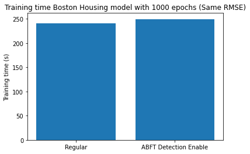

# COMS6998-PDLSP-Final-Project

This repo holds the code for Columbia University COMS 6998 Practical Deep Learning System Performance Final Project. The **AbftTensor.ipynb** contains our experimentation and implementation of ABFT tensor to Keras API. The **ActivationRangeSupervision.ipynb** contains our implementation of Activation Range Supervision method, experimentation steps and results. 

# Project Overview

For this project, our goal was to test the effectiveness of various ML Silent Data Corruption error detection techniques on different types of deep learning models. We hope through our experiementation we will be able to gain an understanding of how effective the methods can be when applied to models not mentioned in the papers.

We have experimented with two following approaches: 

## ABFT Tensor
-   Create a custom ABFT tensor that will implement a checksum to safeguard against SDC similar to [Li et al.](https://arxiv.org/pdf/2103.00130.pdf)
    
-   Protect matmul AxB operations with checksum rows and columns
        
-   Implement between Keras and Tensorflow layers

## Activation Range Supervision

-   Use the activation range supervision clipping method to prevent SDC in the activation values
    
-   Find the upper and lower bounds using a small data set for a trained model to find the minimum and maximum values of the activation of each layer
    
-   Create a new layer for Clipping method and generate a new model with the new layer inserted after each important layers such as CNN, LSTM and Dense NN while keeping the performance the same as the original model

## Results
### ABFT

The ABFT performed with around 3% overhead for our ABFT implementation for training. It has also successfully detected SDC while running. 

### Activation Range Supervision

Activation Range Supervision significantly reduced the SDC in cifar10 and boston housing. Cifar10 performs great because the [paper](https://arxiv.org/pdf/2108.07019.pdf) as shown that the method works well with CNN. It is surprising that the method works well for Dense NN (boston_housing) but it does not prevent SDC with LSTM(imdb)

# Dependencies
- TensorFlow framework (v2.0 or greater)

- Python (v3 or greater)

- Keras framework (part of TensorFlow)

- numpy package (part of TensorFlow)

- TensorFI2 

# Usage

Please run the notebook files in Jupyter notebook or Google Collab with the dependencies. 

To get similar results, please follow the installation instructions for TensorFI2 library. 

Please modify the TensorFI2/experiments/layer-states/confFiles/sample.yaml in the TensorFI2 library to 

``
Target: layer_states
Mode: multiple
Type: bitflips
Amount: 10
Bit: N
``

# References
We have referenced these two papers: 

Li, S., “Efficient Soft-Error Detection for Low-precision Deep Learning Recommendation Models”, arXiv e-prints, 2021.

Zhao, K., “FT-CNN: Algorithm-Based Fault Tolerance for Convolutional Neural Networks”, arXiv e-prints, 2020.

Fault Injection Library: 

"TensorFI: A Flexible Fault Injection Framework for TensorFlow Applications, Zitao Chen, Niranjhana Narayanan, Bo Fang, Guanpeng Li, Karthik Pattabiraman, Nathan DeBardeleben, Proceedings of the IEEE International Symposium on Software Reliability Engineering (ISSRE), 2020